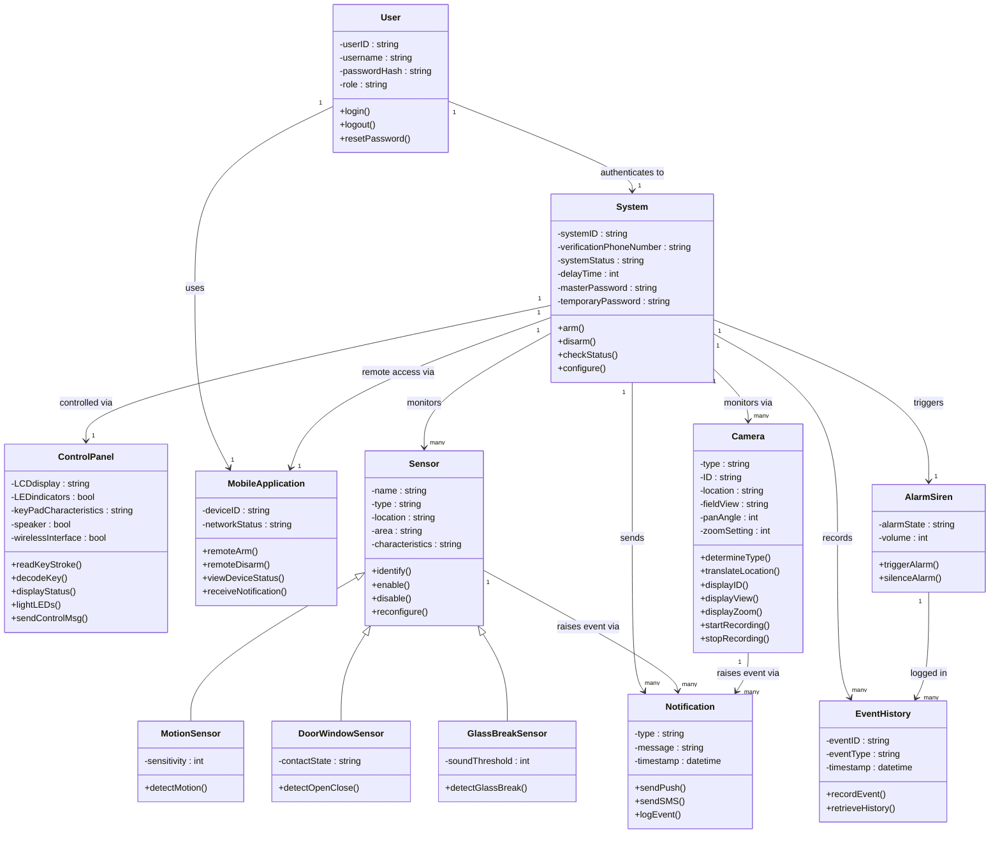

# Class Diagram — HomeSafe Smart Security

Class Diagram នេះត្រូវបានសាងសង់ដោយផ្អែកលើគំរូ SafeHome ក្នុងសៀវភៅ *Software Engineering: A Practitioner's Approach* (Pressman, 7th Ed., Chapters 5–8) ហើយកែសម្រួលឱ្យត្រូវនឹង Feature ជាក់ស្តែងរបស់ HomeSafe (Authentication, Sensors, Camera, Alarm, Notification, Mobile App)។

## Diagram

## Class Summary (សង្ខេប Class)

| Class | តួនាទី (Role) | ប្រភព (Source) |
|---|---|---|
| **User** | គ្រប់គ្រង Authentication (Login/Logout) | Adapted — HomeSafe defines individual passwords, so unlike Pressman's original SafeHome (where Homeowner was rejected as a class), User qualifies here |
| **System** | Core object តំណាង Security System ទាំងមូល (Arm/Disarm, Status) | Pressman Fig. 6.9 (System class) |
| **ControlPanel** | Keypad/Panel object សម្រាប់ Local Input | Pressman Fig. 8.5 (ControlPanel class) |
| **MobileApplication** | Remote Access via App | Adapted — HomeSafe Increment 2 (Remote Access) |
| **Sensor** (+ subclasses) | Base class សម្រាប់ Motion / Door-Window / Glass-Break Sensors | Pressman Fig. 5.4 (Sensor class) |
| **Camera** | Surveillance object (Live Streaming, Recording) | Pressman Fig. 6.10 (Camera, part of FloorPlan) |
| **AlarmSiren** | Alarm object ត្រូវបានបង្កើតឡើងសម្រាប់ Intrusion Response | Adapted — HomeSafe Increment 3 (Security Monitoring) |
| **Notification** | Push/SMS Alert object | Adapted — HomeSafe Increment 5 (Alerts & Automation) |
| **EventHistory** | កត់ត្រា Event ទាំងអស់ (Recording History, Event Log) | Adapted — HomeSafe Increment 4–5 |

## Notes

- Attributes និង Operations សម្រាប់ **System**, **Sensor**, និង **ControlPanel** ត្រូវបានយកចេញផ្ទាល់ពី SafeHome Class Diagrams ក្នុងសៀវភៅ Pressman (Figures 5.4, 6.9, 8.5) ដើម្បីរក្សា Consistency ជាមួយ Textbook Notation ។
- **MotionSensor**, **DoorWindowSensor**, **GlassBreakSensor** ត្រូវបានបន្ថែមជា Subclass នៃ Sensor (Inheritance / Generalization) ព្រោះ HomeSafe រៀបរាប់ពី Sensor ជាក់លាក់ជាច្រើនប្រភេទនៅក្នុង Increment 3 ។
- **AlarmSiren**, **Notification**, **EventHistory** ជា Class ថ្មីដែលមិនមាននៅក្នុង Textbook ដើម ប៉ុន្តែចាំបាច់សម្រាប់គ្របដណ្តប់ Feature របស់ HomeSafe (Alarm, Push/SMS Notification, Event History)។
- ដើម្បីមើល Diagram នេះជា Visual លើ GitHub, GitHub Native support Mermaid ចេញពី Markdown ដោយផ្ទាល់ — គ្រាន់តែបើកឯកសារនេះនៅលើ Web ។

## Reference

Pressman, R. S. *Software Engineering: A Practitioner's Approach*, 7th Edition — Chapter 5 (Understanding Requirements, Fig. 5.4), Chapter 6 (Requirements Modeling: Scenarios, Information, and Analysis Classes, Fig. 6.9, 6.10), Chapter 8 (Design Concepts, Fig. 8.5).
