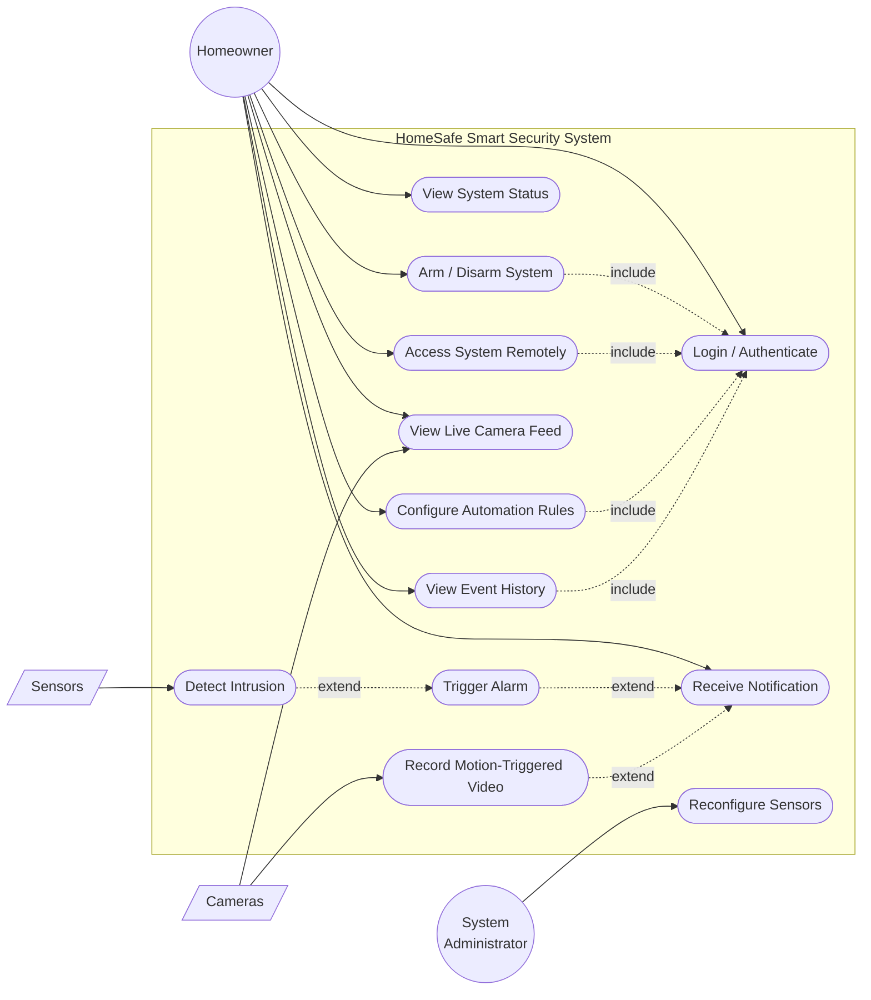

# Use Case Diagram — HomeSafe Smart Security

Use Case Diagram នេះត្រូវបានសាងសង់ដោយផ្អែកលើគំរូ SafeHome ក្នុងសៀវភៅ *Software Engineering: A Practitioner's Approach* (Pressman, 7th Ed., Figures 5.2 & 6.4) ហើយកែសម្រួលឱ្យត្រូវនឹង Feature ជាក់ស្តែងរបស់ HomeSafe (Authentication, Sensors, Camera, Alarm, Notification, Automation)។

Mermaid មិនមាន Native Use-Case Notation ទេ (គ្មាន Stick-figure/Oval Rendering) ដូច្នេះ Diagram ខាងក្រោមប្រើ Flowchart ដើម្បីតំណាង System Boundary (Rectangle), Use Cases (Stadium/Oval shape), និង Actors (Circle/Rectangle) — Notation ដដែលនឹង UML ប៉ុន្តែសរសេរតាមរបៀប Mermaid ។

## Diagram

## Actors (តួអង្គ)

| Actor | ប្រភេទ | ការពិពណ៌នា |
|---|---|---|
| **Homeowner** | Primary (Human) | User ចម្បងដែលប្រើ Control Panel ឬ Mobile App ដើម្បី Login, Arm/Disarm, មើល Camera, កំណត់ Automation |
| **Sensors** | Secondary (Device) | Motion / Door-Window / Glass-Break Sensors ដែលបង្កើត Event ដោយស្វ័យប្រវត្តិនៅពេលមាន Intrusion |
| **Cameras** | Secondary (Device) | ផ្តល់ Live Feed និង Recording ទៅកាន់ System |
| **System Administrator** | Secondary (Human) | គ្រប់គ្រង/Reconfigure Sensors និង System Parameters (ស្រដៀង Support Technician ក្នុង Pressman) |

## Use Cases (សង្ខេប)

| Use Case | Primary Actor | ចំណាំ |
|---|---|---|
| Login / Authenticate | Homeowner | `<<include>>` នៅក្នុង Use Case ភាគច្រើនផ្សេងទៀត ដែលត្រូវការ Security |
| Arm / Disarm System | Homeowner | Core Function — ត្រូវការ Login សិន |
| View System Status | Homeowner | ពិនិត្យ Sensor / Zone Status |
| Access System Remotely | Homeowner | តាមរយៈ Mobile Application (Increment 2) |
| Detect Intrusion | Sensors | Trigger ដោយ Sensor ស្វ័យប្រវត្តិ, `<<extend>>` ទៅ Trigger Alarm |
| Trigger Alarm | (System) | បង្កើតឡើងដោយ Detect Intrusion, `<<extend>>` ទៅ Receive Notification |
| View Live Camera Feed | Homeowner, Cameras | Surveillance Function (Increment 4) |
| Record Motion-Triggered Video | Cameras | `<<extend>>` ទៅ Receive Notification |
| Receive Notification | Homeowner | Push/SMS Alert (Increment 5) |
| Configure Automation Rules | Homeowner | Scheduled Arming / Automation (Increment 5) |
| View Event History | Homeowner | កត់ត្រា Event ទាំងអស់ |
| Reconfigure Sensors | System Administrator | ដូច Pressman's "Reconfigures sensors and related system features" |

## Notes

- រចនាសម្ព័ន្ធ Actor + Use Case (Homeowner arms/disarms, Sensors trigger events, Reconfigures sensors) ត្រូវបានយកគំរូចេញពី Pressman Figure 5.2 (UML use-case diagram for SafeHome home security function) ។
- `<<include>>` សម្រាប់ Login សំដៅលើ Use Case ណាមួយដែលទាមទារ Authentication មុនពេលដំណើរការបន្ត — ដូច Pressman's "Enters a password to allow all other interactions"។
- `<<extend>>` សម្រាប់ Detect Intrusion → Trigger Alarm → Receive Notification សំដៅលើ Event Chain ជាក់ស្តែងរបស់ HomeSafe (Increment 3 → Increment 5)។
- ដើម្បីមើល Diagram នេះជា Visual លើ GitHub, គ្រាន់តែបើកឯកសារនេះនៅលើ Web — GitHub Render Mermaid ដោយស្វ័យប្រវត្តិ ។

## Reference

Pressman, R. S. *Software Engineering: A Practitioner's Approach*, 7th Edition — Chapter 5 (Understanding Requirements, Fig. 5.2, Sec. 5.4), Chapter 6 (Requirements Modeling, Fig. 6.4).
